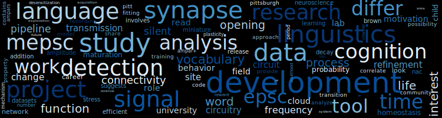

### Hi there 👋

<!--
**manhowong/manhowong** is a ✨ _special_ ✨ repository because its `README.md` (this file) appears on your GitHub profile.

Here are some ideas to get you started:

- 🔭 I’m currently working on ...
- 🌱 I’m currently learning ...
- 👯 I’m looking to collaborate on ...
- 🤔 I’m looking for help with ...
- 💬 Ask me about ...
- 📫 How to reach me: ...
- 😄 Pronouns: ...
- ⚡ Fun fact: ...
-->

I am a neuroscientist 🧠 / aspiring linguist 💻💬 currently working at the University of Pittsburgh.  
Visit my [personal website](https://manhowong.github.io/) to learn more about my interests+research and connect with me on [LinkedIn](https://www.linkedin.com/in/manhowong)!

Below is the TL;DR version of my personal website 😎 The word cloud summarizes my experience (education and work) as of October 2022. Because I am in the middle of career transition, you may notice that there are words from different fields!

[View the source code](https://github.com/manhowong/manhowong.github.io/blob/main/etc/wordcloud.ipynb)
